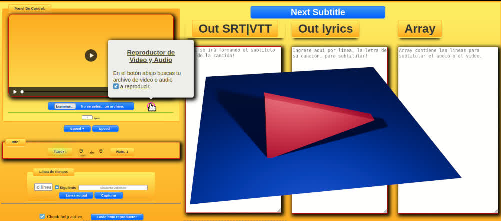
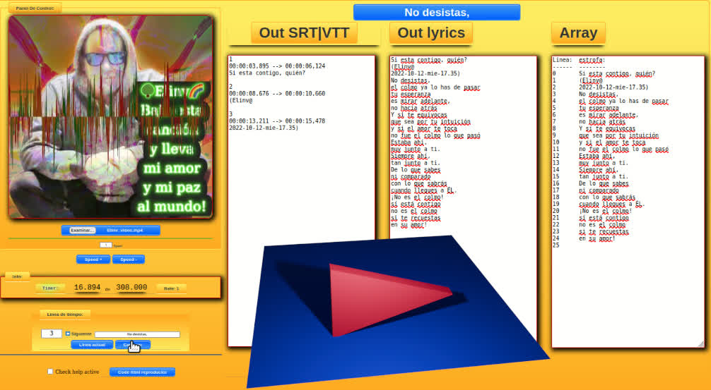
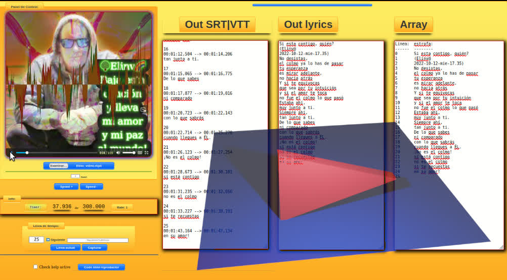

# Creador-de-Subtitulos-SRT-Y-VTT-Elinv

Regalo Elinv a las Plataformas de Video. Regalo a los Youtubers, a los influencers del mundo.
=============================================================================================

# Como comenzar...

- Clonan el respositorio.

## preferentemente...

- en línea de comandos,
- en el directorio que contiene los archivos,
- ejecutar: 'php -S localhost:8000'
- 
- Título : `Creador de Subtítulos SRT y VTT ~ Elinv`
- Autor :  `Elinv`
- Url Github: [https://github.com/Elinv/Creador-de-Subtitulos-SRT-Y-VTT-Elinv]()
- 
- 

---

- [](https://drive.google.com/file/d/1XtsjE7xhEYJfYg58kGyA_u5V2pcdPE8h/preview)
- [](https://drive.google.com/file/d/1wdSKHU05JrOqsas9lUkT2GMZYJqCCX4k/preview)
- - [](https://drive.google.com/file/d/17-bmCK_Tz3yvr3ntIfZwEmFKzYq22e0B/preview)

## Install & Dependence (Ninguna)

- html
- javascript
- css

---

### Regalo Elinv a las Plataformas de Video.

Humilde obsequio a YouTube,
TikTok, Facebook, Instagram,
a todos...

Regalo a los Youtubers,
a los influencers del mundo.

Para que lo que hacen
pueda ser fácilmente subtitulado
y la obra y la palabra del Señor,
llegué a todos.

```
- Es vuestro...
```

Este subtitulador,
es vuestro,
y les dejo en esta bellísima plataforma
que es GitHub
el código fuente,
por si lo quieren mejorar,
hacerlo superior y más funcional.

```
- A la promesa de nuestro mejor futuro, a los jóvenes:
```

Es un regalo también a todos
los jóvenes,
a los internautas,
a los programadores,
que crean que pueden usar ese código
para trabajar,
y ayudarse en su vida
o la de algún familiar.

Háganlo,
úsen toda las ideas de Elinv
y Dios les proveerá
un presente y futuro maravilloso.

```
- El conocimiento es de todos!
```

Úsenlo libremente,
es de libre dominio,
y lleven todo el bien
a todos sus hermanos,

especialmente
a aquellos
menos favorecidos.

No les demuestren
vuestra posición,
solo déjenle ver
el amor de Dios Padre.

---

Qué hermoso es tenerlos
a todos,
ayudando.

```

Elinv

